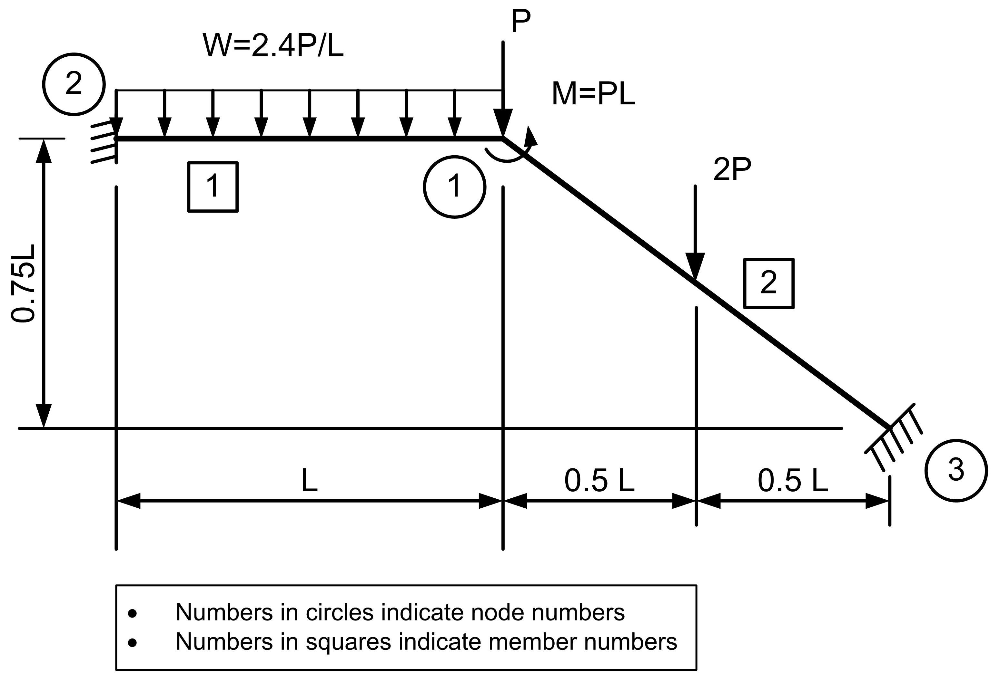

# User Manual

## Units
Data input can be in any set of consistent units. Thus, if lengths are in $m$, then cross-section area **must** be in $m^2$. Similarly,, if forces are in $kN$, then $E$ must be in $kN/m^2$.

## Input Formats
Data can be input to `pf.py` in one of the following ways:

1. As data, mostly in the form of a series of `numpy.ndarray`s with specific variable names, in a Python script. This data must subsequntly converted into Pandas dataframes using `pf.data2df()` function.
2. As Pandas DataFrames with specific variable names, column names and column `dtypes`. 
3. As a TOML file with specific names for variables
4. As an sqlite3 database with specific names for tables and specific schema for each table

Irrespective of how the data is input, the entire input data is finally represented in the form of Pandas DataFrames with the specified names, column names and data types.

In the description below, `np.ndarray[(:, 2), np.float_]` implies a `numpy` array with as many rows as required (`:`) and all elements of type `np.float_`. As an example a coordinates of a 2 node structure could be defined as follows:
```python
xy = np.array([ [0, 0], [5, 0] ], dtype=np.float_)
```
which has 2 rows and elements are stored as floating point numbers.

An empty matrix, such as when no nodal loads are applied on the structure should be resresented as:
```python
jtloads = np.array([], dtype=np.float_)
```

## Input Data
The names of variables and their column names and data types are as follows:

1. `title: str` is a string specifying a user defined title for the problem
2. `xy: np.ndarray[(:, 2), np.float_]` are the `(x, y)` coordinates of the nodes of the plane frame. Row index + 1 is the node number. In a Pandas DataFrame, the column names must be `x` and `y`. Data types of both columns must be `np.float_`.
3. `conn: np.ndarray[(:, 3), np.int_]` is the connectivity matrix for the members of the structure. Row index + 1 is the member number. Columns 1 and 2 represent the origin node `n1` and far node `n2` of the member and column 3 represents the material property id, to be defined later. In a Pandas DataFrame, the column names are `node1`, `node2`, `mprop`. All columns are of type `np.int_`.
4. `bc: np.ndarray[(:, 4), np.int_]` is the zero boundary condition matrix specifying the support conditions. Row index + 1 is the support constraint for a constrained node. Column 1 specifies the node id to which the constraints are to be applied. Columns 2, 3 and 4 represent the constraints to be applied to the `ux`, `uy` and `rz` degrees of freedom of the node, where `ux` and `uy` are linear displacements along the global `x` and `y` axes and `rz` is the rotatiion about the global `z` axis. Constraint code `1` implies the corresponding degree of freedom is constrained (zero displacement) and `1` implies the corresponding degree of freedom is unconstrained (non-zero unknown displacement that needs to be determined). For example, if node number 1 is a fixed support, it would be represented by the row `2 1 1 1` and if node number 3 is a hinged support, it would be repesented as `3 1 1 0`. Constraints for a node need be specified only when one or more of its degrees of freedom are constrained. Remaining nodes are considered unconstrained.
5. `mprop: np.ndarray[(:, 3), np.float_]` is a matrix representing each unique material property. Row index + 1 is the material number. Column 1 repesents the modulus of elasticity `E`, column 2 repesents the cross-section area `A` and column 3 repesents the second moment of area about the axis of bending `Iz`. In a Pandas DataFrame, the column names should be `E`, `A` and `Iz`. All columns are of type `np.float_`. When multiple members have the same material properties, it need be defined only once and the material property id must be indicated in the connectivity matrix `conn` defined above.
6. `jtloads: np.ndarray[(:, 4), np.float]` are the nodal loads, with reference to **global axes**. Row index + 1 is the nodal load number. Column 1 represents the number of the node to which the nodal load must be assigned. Columns 2 and 3 repesent the magnitudes of the `x` and `y` components of the load applied at the node and column 3 repesents the moment applied about the `z` axis at the specified node. Each nodal load must be defined independently, even when it may be identical to another load applied on a different node. In a Pandas DataFrame, the columns names must be `node`, `Px`, `Py`, `Mz`. Data type of the first column must be `np.int_` and columns 2 to 4 must be `np.float_`. When defining joint loads as a `numpy` array, all columns are defined as `np.float_` and the function `pf.data2df()` will automatically ensure the proper column names and data types. **Note:** If no nodal loads are applied on any of the nodes of the structure, it must be an empty array or DataFrame.
7. `memloads: np.ndarray[(:, 7), np.float_]` are the applied member actions, with reference to **member axes**. The negative values of the applied member end actions, transformed to global axes, will be taken as the equivalent joint loads in assembling the load vector. Row index + 1 is the member load number. Column 1 represents the number of the member to which the nodal load must be assigned. Columns 2, 3, 4 repesent the magnitudes of the loads applied at the origin node of the member and columns 5, 6, 7 represent the loads applied at the far node of the member. Loads at each node follow the sequence `Px`, `Py`, `Mz`. Each member load must be defined independently, even when it may be identical to another load applied on a different member. In a Pandas DataFrame, the columns names must be `member`, `Px1`, `Py1`, `Mz1`, `Px2`, `Py2`, `Mz2`. Data type of the first column must be `np.int_` and columns 2 to 7 must be `np.float_`. When defining member loads as a `numpy` array, all columns are defined as `np.float_` and the function `pf.data2df()` will automatically ensure the proper column names and data types. Member loads must be computed as the negative of the fixed end reactions produced in the member when subjected to the specified loads (may be one or more). These must be computed by the user and the program at present does not calculate these automatically for the common types of loads noramlly encountered in practice. **Note:** If no loads are applied on any of the members of the structure, it must be an empty array or DataFrame.

## Example


### Units
Lengths are in inches and forces are in kips. Therefore, area must be in $\text{in}^2$, $I_z$ must be in $\text{in}^4 and $E$ in $\text{kips}/\text{in}^2$$.

### Coordinate Axes
Let the global $x$ axis be horizontal and passing through node 3 and $y$axis be vertical and passing through node 1. Then, the global $z$ axis will be perpendicular to the plane of the frame and pointing toward the observer.

Each member has a member axis, with the member $x$ axis has its origin at the origin node of the member and is positive towards the far node of the member. The member $y$ axis is such that the member $z$ axis must point in the same direction as the global $z$ axis. Thus, considering a horizontal member (that is, member parallel to the global $x$ axis) with its left end as the origin node, member $y$ axis must point upwards, so the member $z$ axis is parallel to the global $z$ axis. However, for the same member, if the right node is considered the origin node, the member $y$ axis, at the right node, must point downward to ensure that the member $z$ axis points towards the observer (as per the right hand rule). This applie even when the member is 

It is important to understand the orientations of the global and member axes as they are required when computing nodal loads and member end actions due to loads applied on the members.
### Member End Actions
$P=10~\text{kips}, L=100~\text{in}, E=10000~\text{ksi}, A = 10~\text{in}^2, I_z = 1000~ \text{in}^4$

### Member end force calculation
#### Member 1
$M_1 = -M_2 = \frac{0.24 \times 100^2}{12} = 200~\text{kips-in}$

$R_1 = R_2 = \frac{0.24 \times 100}{2} = 12~\text{kips}$

#### Member 2
In global axes, the reactions are:

$M_1 = -M_2 = \frac{20 \times 100}{8} = 250~\text{kips-in}$

$R_1 = R_2 = \frac{20}{2} = 10~\text{kips}$

Origin node is the left node, $x$ axis goes from origin node to the far node and $y$ axis is upwards so as to maintain the $z$ axis perpendicular to the paper and coming out towards the reader, same as the global $z$ axis.

Resolving the reactions along the member axes, we get:
$\theta = \tan^{-1} \left( \frac{75}{100} \right) = 36.8699~\text{degrees}, \cos \theta = 0.8, \sin \theta = 0.6$.

$R_{x1} = R_{x2} = -6~\text{kN}, R_{y1} = R_{y2} = 8~\text{kN}$

**Note:** Ideally, all such calculations must be performed by the program and not the user, but that is a goal for the future.

### Node Cooridinates

Name of the variable: `xy`. Pandas column names: `x`, `y`. Data types of both columns: `np-float_`.

|   `x`   |   `y`  |
|--------:|-------:|
|  100.0  |  75.0  |
|    0.0  |  75.0  |
|  200.0  |   0.0  |

### Member Connectivity

Name of the variable: `conn`. Pandas column names: `member`, `node`, `node2`, `mprop`. Data types of all coumns is `np.int_`.

| `member` | `node1` | `node2` | `mprop` |
|:--------:|:-------:|:-------:|:-------:|
|  1  |  2  |  1  | 1 |
|  2  |  1  |  3  | 1 |

**Note:** Origin node of member 1 is defined as node 2 and far node as node 1, Therefore, the member $x$ axis is parallel to the global $x$ axis and points in the same direction. Similarly, member $x$ axis of member 2 has its origin at node 1 and is inclined to the global $x$ axis at an angle $\theta = 36.8699$ degrees and pointing downwards.

### Boundary Conditions

Name of the variable: `bc`. Pandas column nmaes: `node`, `ux`, `uy`, `rz`. Data types of all columns: `np.int_`.

Supports at both the nodes 2 and 3 are fixed. Thus all displacements, $u_x, u_y, r_z$ are restrained.

|`node` | `ux` | `uy` | `rz` |
|:-----:|:----:|:----:|:----:|
| 2 | 1 | 1 | 1|
| 3 | 1 | 1 | 1|

### Material Properties

Name of variable: `mprop`. Pandas column names: `E`, `A`, `Iz`. Data type of all columns: `np.float_`.

Both members of this structure have the same material property and therefore we need only one material property to define this structure.

| `E`  |  `A`  |  `Iz`  |
|-----:|------:|-------:|
| 10000|     10|    1000|

## Nodal Loads
Name of variable: `jtloads`. Pandas column names: `node`, `Px`, `Py`, `Mz`. Data type of columns: `np.int_`, `np.float_`, `np.float_`, `np.float_`.

|`node` | `Px` | `Py` | `Mz` |
|:-----:|-----:|-----:|-----:|
| 1  | 0 | -10 | -1000|

**Note:** Sign convention for nodal loads is as per the global axes. Thus, $P_x, P_y$ are positive if they have the same sign as the global $x$ and $y$ axes, respectively. Sign of $M_z$ is as per the right hand rule. If direction of $M_z$ is the same as the direction of the fingers of the right hand when holding the global $z$ axis with the right hand with the thumb pointing in the same directioin as the global $z$ axis.

## Member End Actions
Name of variable: `memloads`. Pandas column names: `member`, `Px1`, `Py1`, `Mz1`, `Px2`, `Py2`, `Mz2`. Data types of columns: `np.int_`, `np.float_`, `np.float_`, `np.float_`, `np.float_`, `np.float_`, `np.float_`.

| `member` |  `Px1`  |  `Py1`  |  `Mz1`  |  `Px2`  |  `Py2`  |  `Mz2`  |
|:--------:|--------:|--------:|--------:|--------:|--------:|--------:|
|   1      |  0  |  12  |  200 |  0  |  12 | -200  |
|   2      | -6  |   8  |  250 | -6  |   8 | -250  |

